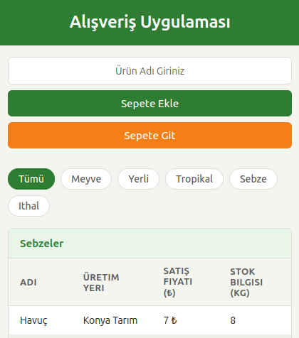

# TR
# Alışveriş Uygulaması
JavaScript ile geliştirilmiş, localStorage tabanlı iki sayfalı bir alışveriş uygulaması. Ürünleri kategoriye göre filtreleyebilir, sepete ekleyebilir ve toplam tutarı görebilirsiniz.

## Canlı Önizleme

[Proje Önizlemesi.](https://dursunkokturk.github.io/JavaScript-Project-Shopping-App--With-localStorage-)

## Özellikler

- Ürün Listeleme — Sebzeler ve Meyveler ayrı tablolarda, üretici ve fiyat bilgisiyle gösterilir
- Kategori Filtreleme — Dinamik olarak oluşturulan pill butonlarla kategoriye göre anlık filtreleme (Tümü, Meyve, Sebze, Yerli, Tropikal, İthal)
- Sepete Ekleme — İsim girilerek ürün sepete eklenir; aynı ürün tekrar eklenirse adet artar
- Stok Takibi — Sepete her ekleme işleminde stok 1 azalır; stoku biten ürün "Tükendi" olarak gösterilir
- Sepet Sayfası — Sepetteki ürünler, birim fiyat ve toplam tutar ayrı bir sayfada listelenir
- Sepeti Temizle — Onay sonrası sepet ve ürün stokları sıfırlanır
- localStorage Kalıcılığı — Sayfa yenilense bile sepet ve stok bilgisi korunur
- Duyarlı Tasarım — Mobilde dikey, masaüstünde (>1109px) yatay düzen

## Sayfalar

| Sayfa       | Açıklama                                      |
| ----------- |-----------------------------------------------|
| index.html  | Ürün listeleme, filtreleme ve sepete ekleme   |
| basket.html | Sepet içeriği, toplam tutar ve sepeti temizle |

## İş Mantığı

- Ürünler defaultProducts dizisinden yüklenir; localStorage'da kayıtlı veri varsa o kullanılır
- Kategori butonları Set yapısıyla ürünlerdeki tüm kategorilerden otomatik türetilir
- Seçili kategori localStorage'a kaydedilir; sayfa değişiminde aktif filtre korunur
- Sepeti temizleme hem userBasket hem productList'i localStorage'dan siler ve stokları varsayılana döndürür

## Teknolojiler

| Teknoloji        | Açıklama                                   |
| ---------------- |--------------------------------------------|
| HTML5            | İki sayfalı yapı (index.html, basket.html) |
| CSS3             | CSS değişkenleri, Flexbox, @media sorgusu  |
| JavaScript (ES6) | DOM yönetimi, localStorage, dinamik render |

## Proje Yapısı
shopping-app/  
├── index.html  
├── basket.html  
└── assets/  
    ├── css/  
    │   └── style.css  
    └── js/  
        └── products.js  

## Kurulum
Bağımlılık yoktur. Doğrudan tarayıcıda açılır.
bash# Repoyu klonlayın
git clone https://github.com/kullanici-adi/shopping-app.git

### Proje klasörüne girin
cd shopping-app

### index.html dosyasını tarayıcıda açın
open index.html

#### ⚠️ localStorage kullanıldığından uygulamanın bir sunucu üzerinden (Live Server vb.) çalıştırılması önerilir.

## Tasarım Detayları

- Renk Paleti (CSS Değişkenleri):

    - --primary: #2E7D32 — Koyu yeşil (başlık, buton, aktif kategori)
    - --accent: #F57F17 — Amber (sepete git, geri dön butonu)
    - --danger: #C62828 — Kırmızı (sepeti temizle butonu)
    - --bg-page: #F5F5F0 — Sayfa arka planı
    - --row-stripe: #F0F0EB — Tablo çift satır şeridi

- Font: System UI (system-ui, -apple-system, Segoe UI...)
- Breakpoint: 1109px üzerinde yatay form düzeni

## Varsayılan Ürünler
Uygulama 20 ürünle başlar:

| 10 meyve | 10 sebze  |
| -------- |-----------|
| Elma     | Havuç)    |
| Muz      | Domates   |
| Çilek    | Brokoli   |
| Portakal | Salatalık |
| Üzüm     | Biber     |
| Karpuz   | Patlıcan  |
| Armut    | Ispanak   |
| Kiraz    | Patates   |
| Şeftali  | Soğan     |
| Limon    | Kabak     |

# EN
# Shopping App
A two-page shopping application built with JavaScript, using localStorage. You can filter products by category, add them to your cart, and view the total amount.

## Live Preview
Project Preview.

## Features

- Product Listing — Vegetables and Fruits displayed in separate tables with producer and price information
- Category Filtering — Instant filtering by category using dynamically generated pill buttons (All, Fruit, Vegetable, Local, Tropical, Imported)
- Add to Cart — Products are added to the cart by entering a name; adding the same product again increases the quantity
- Stock Tracking — Stock decreases by 1 with each add-to-cart action; products that run out are shown as "Sold Out"
- Cart Page — Cart items, unit price, and total amount are listed on a separate page
- Clear Cart — Cart and product stocks are reset after confirmation
- localStorage Persistence — Cart and stock data is preserved even after page refresh
- Responsive Design — Vertical layout on mobile, horizontal layout on desktop (>1109px)

## Pages

| Page        | Description                                 |
| ----------- |---------------------------------------------|
| index.html  | Product listing, filtering, and add to cart |
| basket.html | Cart contents, total amount, and clear cart |

## Business Logic

- Products are loaded from the defaultProducts array; if data is saved in localStorage, that is used instead
- Category buttons are automatically derived from all product categories using a Set structure
- The selected category is saved to localStorage; the active filter is preserved across page changes
- Clearing the cart deletes both userBasket and productList from localStorage and resets stocks to default

## Technologies

| Technology       | Description                                     |
| ---------------- |-------------------------------------------------|
| HTML5            | Two-page structure (index.html, basket.html)    |
| CSS3             | CSS variables, Flexbox, @media query            |
| JavaScript (ES6) | DOM management, localStorage, dynamic rendering |

## Project Structure
shopping-app/  
├── index.html  
├── basket.html  
└── assets/  
    ├── css/  
    │   └── style.css  
    └── js/  
        └── products.js  

## Installation
No dependencies. Opens directly in the browser.
bash# Clone the repo
git clone https://github.com/username/shopping-app.git

### Navigate to the project folder
cd shopping-app

### Open index.html in the browser
open index.html

#### ⚠️ Since localStorage is used, it is recommended to run the application via a server (Live Server, etc.).

## Design Details

- Color Palette (CSS Variables):

    - --primary: #2E7D32 — Dark green (header, button, active category)
    - --accent: #F57F17 — Amber (go to cart, back button)
    - --danger: #C62828 — Red (clear cart button)
    - --bg-page: #F5F5F0 — Page background
    - --row-stripe: #F0F0EB — Table alternating row stripe

- Font: System UI (system-ui, -apple-system, Segoe UI...)
- Breakpoint: Horizontal form layout above 1109px

## Default Products
The app starts with 20 products:

| 10 Fruits  | 10 Vegetables |
| ---------- |---------------|
| Apple      | Carrot        |
| Banana     | Tomato        |
| Strawberry | Broccoli      |
| Orange     | Cucumber      |
| Grape      | Pepper        |
| Watermelon | Eggplant      |
| Pear       | Spinach       |
| Cherry     | Potato        |
| Peach      | Onion         |
| Lemon      | Zucchini      |
